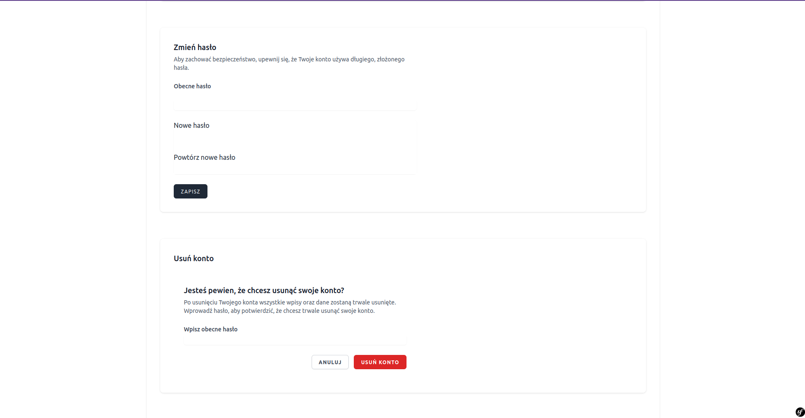

# Mikroblog IT
> It is a microblogging application focused on IT topics.

## Table of Contents
* [General Info](#general-information)
* [Technologies Used](#technologies-used)
* [Features](#features)
* [Screenshots](#screenshots)
* [Setup](#setup)
* [Project Status](#project-status)
* [Contact](#contact)
* [License](#license)


## General Information
The aim of the application is to create informative posts about IT topics and bring together users of this platform. The application allows you to create your account, make posts, follow other users and their posts, and react to these posts.


## Technologies Used
- PHP - version 8.1
- Symfony - version 6.2.14
- Twig - version 2.13
- Tailwind CSS - version 3.3.3
- Webpack - version 5.74.0
- MySQL - version 8.0.22
- Pusher - version 7.2


## Features
List the ready features here:
- Registration, login, user information editing, password reset, and account deletion,
- Setting a profile avatar,
- Creating, editing, and deleting new blog posts,
- Post search and pagination,
- Liking posts, following users and their posts,
- API queries for registration, login, and post creation.


## Screenshots




## Setup
```bash
$ git clone https://github.com/michu16/mikroblog-it.git
$ cd project
$ composer install
$ npm install
$ php bin/console migration:migrate
$ php -S localhost:8000 -t public/
$ open http://localhost:8000/
```


## Project Status
The project is completed, and there are no plans for its further development.


## Contact
Created by Michu16, e-mail: miichusss@gmail.com

## License 
This project is licensed under the MIT License.

